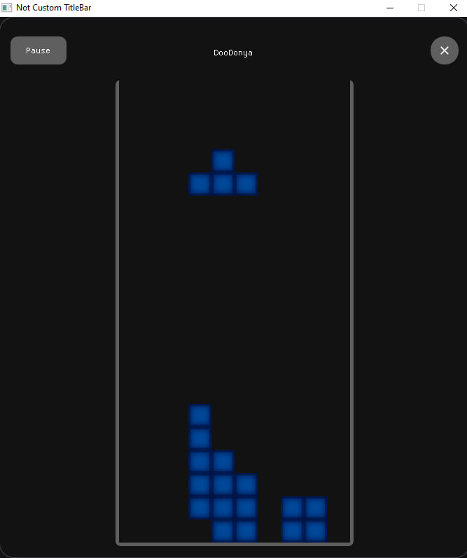

# Tetris Clone Using OpenGL

I decided to make a clone of a Tetris in educational purposes.

Before last commit there was no collision for blocks, only collision with borders of the screen.

## Check List

- [x] Collision For Blocks
- [ ] Deleting Lines When The Line Is Full

## Dependencies

App is built with:
- MinGW
- SDL2-devel-2.32.8-mingw
- OpenGL 3.3
- Dear ImGui [Official Repo](https://github.com/ocornut/imgui)

## How Game Looks

## Controls

- To move left and right - Arrow keys right and left

- To rotate - A and D
