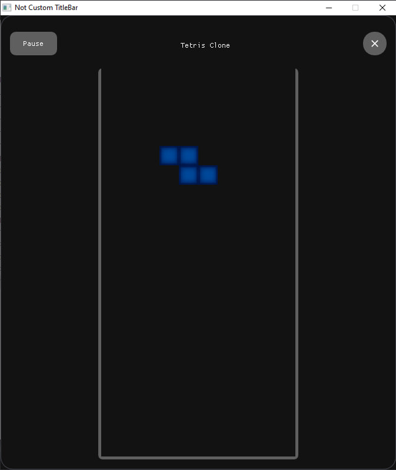

# Tetris Clone Using OpenGL in C++

Developing a Tetris clone for educational purposes.

I'm currently making this tetris clone using SDL2 + OpenGL and Dear ImGui as a user GUI.

For now there is only controls, collision with the borders and an implementation for spawning new blocks. In the future i'm planning to add collision with the blocks as well.

[x] Controls
[x] Collision with the borders
[x] Spawning new blocks
[ ] Blocks collision
[ ] Block hold system
[ ] Window with the next block
[ ] Score system
[ ] GUI updates

## Brief Look At The Game

Dependencies:

Project is built with Cmake, MinGW.

Frameworks and API used in project

- SDL2 [Repo](https://github.com/libsdl-org/SDL/releases) **SDL2-devel-2.32.10-mingw**

- OpenGL 3.3 + glad

- Dear ImGui [Official repo](https://github.com/ocornut/imgui)
